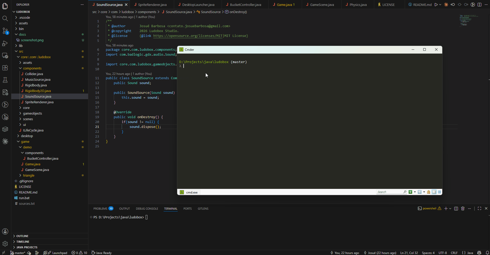

# 🚀 Ludobox Framework

This is a simple 2D Game Framework to desktop.


> [!NOTE]
> Ludobox is under active development. Feedback, bug reports, and suggestions are welcome!

## Demo



## ✨ Features

- ✅ Game Objects and Components
- ✅ Assets Manager
- ✅ Scene Manager
- ✅ 2D Render
---

## 🛠 Technologies

- Java 21
- LibGDX
- OpenGL

---

## 📁 Folder Structure

```text
project/
├── assets/
│   ├── textures/
│   └── sounds/
├── lib/
├── src/
│   ├── core/
│   │   ├── assets/
│   │   ├── components/
│   │   └── gameobjects/
│   │   └── scenes/
│   │   └── ui/
│   │   └── core/
│   └── game/
├── docs/
└── README.md
```

---

## ⚙️ Install

Clone repository:

```bash
git clone https://github.com/josuebsilva/ludobox-framework.git
cd project
```

Execute:

```bash
./run
```

---

## 🎮 How use

Create a Game Scene

```java
public class GameScene extends Scene { 
    @Override
    public void onCreate() {
        //Instance game objects and load assets
    }

    @Override
    public void onUpdate() {
        //This call every frame
    }
}
```
Call game launcher

```java
public class DesktopLauncher {
    public static void main(String[] args) throws Exception {
        System.out.println("Ludobox Engine");

        Lwjgl3ApplicationConfiguration config = new Lwjgl3ApplicationConfiguration();
        config.setTitle("Ludobox Engine");
        config.setWindowedMode(Config.WIDTH, Config.HEIGHT);
        config.setForegroundFPS(60);
        config.useVsync(true);

        new Lwjgl3Application(new Ludobox(new GameScene()), config);
    }
}
```

Example Game Object:

```java
GameObject player = instantiate("Player");

player.addComponent(
    new SpriteRenderer(
        assetLoader.getTexture("player.png")
    )
);

scene.add(player);
```

---

## 💡 Code Example

### Asset Manager

```java
AssetLoader assets = new AssetLoader();

assets.queueTexture("background.png");
assets.loadAll();

Texture background =
    assets.getTexture("background.png");
```

### Components System

```java
public class PlayerController extends Component {

    @Override
    public void onUpdate(float deltaTime) {
        if (Gdx.input.isKeyPressed(Keys.A)) {
            transform.position.x -= speed * delta;
        }
    }
}
```

---

## 🗺 Roadmap

- [x] GameObject Systems
- [x] Sprite renders
- [x] Components System
- [ ] 2D Physics
- [ ] UI
- [ ] Particle System
- [ ] Multplatform

## Contributing

Thank you for your interest in contributing!

At this early stage, Ludobox is under heavy development. I'm currently **not accepting pull requests** while the core architecture is being designed.

You're welcome to:
- Report bugs
- Open feature requests
- Ask questions
- Share ideas and feedback

Once the architecture becomes more stable, contribution guidelines will be published.